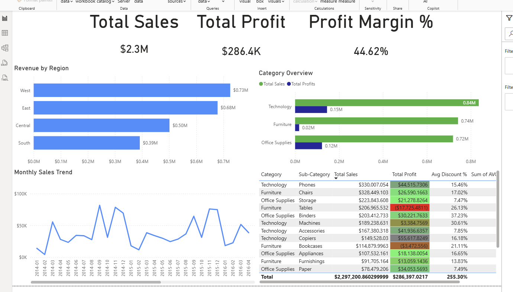

# Superstore Sales Analytics Pipeline | Snowflake + Power BI

## Overview

Built an end-to-end analytics project using Snowflake and Power BI to transform Superstore sales data into business-ready insights.

The project follows a layered data architecture (raw, clean, calculation, and analytics) to structure and prepare data for reporting, then surfaces key revenue, profit, discount, and product performance metrics in an executive dashboard.

---

## Tools Used

- Snowflake (Data Warehouse)
- SQL (Data Transformation)
- Power BI (Data Visualization)
- CSV (Source Data)
- GitHub (Version Control)

---

## Architecture

- **RAW**: Ingested source data from CSV  
- **CLEAN**: Standardized column names and data types  
- **CALC**: Derived business metrics (profit margin, shipping days, discount %)  
- **ANALYTICS**: Aggregated views for reporting and dashboard consumption  

---

## Key Metrics

- Total Sales  
- Total Profit  
- Profit Margin %  
- Revenue by Region  
- Monthly Sales Trend  
- Sales vs Profit by Category  
- Avg Discount %  

---

## Dashboard Preview

---

## Key Insights

- West region generated the highest revenue across all regions  
- Technology is the top-performing category in both sales and profit  
- Some furniture sub-categories show negative profitability despite strong sales  
- Higher discount levels are associated with reduced profitability in certain categories  
- Monthly sales trends show variability suggesting possible seasonality  

---

## 📂 Repository Structure
